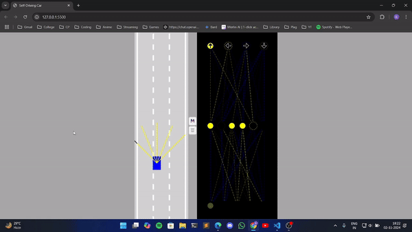

Here's a documentation format for your self-driving car project with catchy emojis to make it visually engaging:

---

# 🚗 Self-Driving Car Project 🚗

Explore a unique self-driving car simulation powered by a neural network model using a genetic algorithm. This project showcases autonomous driving on busy roads, with everything built from scratch in HTML, CSS, and JavaScript!

### 🌐 Hosted Project
**Check it out live** on Vercel: [Self-Driving Car Simulation](https://self-driving-car-rose.vercel.app/)

### 💻 Run Locally
1. **Clone and download** the repository.
2. Open `index.html` to launch the project locally.

---

### 🔧 Project Overview
- **Tech Stack**: HTML, CSS, JavaScript
- **Core Components**: Neural Network, Genetic Algorithm—all implemented from scratch!
  
💡 **Why JavaScript?**
Using Python could simplify the process with built-in libraries, but JavaScript was chosen to fully understand neural network and genetic algorithm implementations. Plus, hosting JavaScript on the web is simpler! 

---

### 🚀 Quickstart Instructions
1. **Manual Mode**:
   - Open `main.js`.
   - **Line 11**: Set `N = 1`.
   - **Line 53**: Change `"AI"` to `"KEYS"` to enable arrow keys for manual driving.
   - **Refresh** the browser and control the car with the arrow keys!

2. **Autonomous Mode**:
   - The hosted project generates 100 random cars, each driving based on their weights and biases.
   - **Tip**: For faster parallel processing, set `N = 1000` (adjust based on computer power).

### 💾 Save a Model
1. When a car model shows good performance, press the **💾 icon** on the screen to save it to `localStorage`.
2. On the next run, the saved model becomes the “bestModel,” followed by other cars with slight random adjustments to their weights and biases.
3. **Experiment** with `alpha` values to improve model efficiency—try 0.1, 0.2, or 0.3 to see different results!

### 📹 Best Model Video
Check out this demo of the best-performing model on local tuning:

---

🚘 **Enjoy the journey of building and tuning your own self-driving car model!**